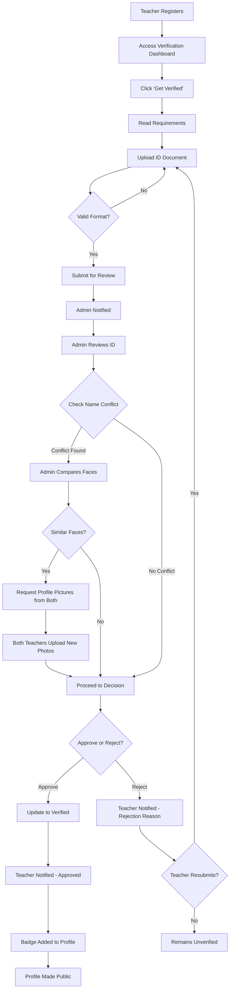

# Teacher Verification System

## Overview

The Teacher Verification System is a multi-tier credential verification process that builds trust and credibility for teachers on the platform. It ensures that teachers are real people with legitimate qualifications, protecting students and parents while helping quality teachers stand out.

**Feature Status:** 🔄 In Development  
**Priority:** High  
**Target Release:** Phase 1 - MVP  
**Owner:** Backend Team  
**Last Updated:** 2024-11-30

---

## User Story

**As a teacher**, I want to get verified on the platform so that students and parents can trust my credentials and I can access advanced features.

**As a student/parent**, I want to see verified teacher credentials so that I can make informed decisions about which teachers to choose.

**As an admin**, I want a structured verification process so that I can efficiently verify teacher authenticity while maintaining platform quality.

---

## Business Value

### For Platform
- Builds trust and credibility
- Differentiates from competitors
- Reduces fraud and fake accounts
- Enables premium features for verified teachers
- Creates quality assurance system

### For Teachers
- Establishes professional credibility
- Unlocks advanced features
- Increases student enrollment
- Builds reputation
- Commands higher rates

### For Students
- Ensures teacher authenticity
- Reduces risk of fraud
- Provides peace of mind
- Helps make informed decisions

---

## Requirements

### Functional Requirements

#### Tier 1 - Basic Verification
**FR-V1.1:** Teachers must upload a government-issued photo ID  
**FR-V1.2:** System must detect and flag name conflicts within the same region  
**FR-V1.3:** Admin must review and approve/reject ID submissions  
**FR-V1.4:** System must compare ID photo with profile photo  
**FR-V1.5:** Upon approval, teacher receives "Verified" badge  
**FR-V1.6:** Verified teachers become publicly searchable  

#### Tier 2 - Enhanced Verification
**FR-V2.1:** Teachers must complete Tier 1 before accessing Tier 2  
**FR-V2.2:** System must provide video call scheduling interface  
**FR-V2.3:** Admin conducts live video verification call (10-15 minutes)  
**FR-V2.4:** All verification calls must be recorded and stored securely  
**FR-V2.5:** Upon approval, teacher receives "Enhanced Verified" badge  
**FR-V2.6:** Enhanced verified teachers get priority in search results  

#### Tier 3 - Super Verified (Trusted Teacher)
**FR-V3.1:** Teachers must have 100+ completed sessions  
**FR-V3.2:** Teachers must have 4.0+ average rating  
**FR-V3.3:** Teachers must upload teaching degree/certificate  
**FR-V3.4:** Admin verifies credentials via video call (20-30 minutes)  
**FR-V3.5:** System must verify teaching qualification authenticity  
**FR-V3.6:** Upon approval, teacher receives "Trusted Teacher" badge  
**FR-V3.7:** Super verified teachers can use direct enrollment (students enroll without approval)  
**FR-V3.8:** Super verified teachers appear first in search results  

#### Name Conflict Resolution
**FR-NC.1:** System automatically detects identical teacher names in same region  
**FR-NC.2:** Admin must perform facial comparison for similar-looking teachers  
**FR-NC.3:** If faces are similar, both teachers must upload profile pictures  
**FR-NC.4:** Teachers with name conflicts remain non-public until resolved  
**FR-NC.5:** System maintains differentiation requirements for conflicting names  

### Non-Functional Requirements

**Performance:**
- **NFR-P1:** ID verification processing time: < 48 hours
- **NFR-P2:** Video call scheduling: Real-time availability
- **NFR-P3:** Badge update: Immediate upon approval
- **NFR-P4:** Search index update: < 5 minutes after verification

**Security:**
- **NFR-S1:** All ID documents encrypted at rest (AES-256)
- **NFR-S2:** All video calls recorded and stored securely for 7 years
- **NFR-S3:** Admin access logged with full audit trail
- **NFR-S4:** Verification data accessible only to authorized admins
- **NFR-S5:** GDPR compliant data handling

**Scalability:**
- **NFR-SC1:** Support 1000+ verification requests per day
- **NFR-SC2:** Video call storage: Unlimited with cloud storage
- **NFR-SC3:** Concurrent admin processing: 10+ admins

**Usability:**
- **NFR-U1:** ID upload process: < 3 minutes
- **NFR-U2:** Clear rejection reasons provided to teachers
- **NFR-U3:** Video call instructions clear and accessible
- **NFR-U4:** Mobile-friendly ID upload

---

## User Interface

### Teacher-Facing Screens

#### 1. Verification Dashboard
**Location:** Teacher Dashboard → Profile → Verification  
**Purpose:** Central hub for verification status and actions

**Components:**
- Current verification tier badge
- Next tier requirements (if applicable)
- Call-to-action buttons
- Progress indicators
- Benefits explanation

**States:**
- Unverified
- Tier 1 Pending
- Tier 1 Verified
- Tier 2 Pending
- Tier 2 Verified
- Tier 3 Eligible
- Tier 3 Pending
- Tier 3 Verified (Trusted Teacher)

#### 2. ID Upload Screen (Tier 1)
**Components:**
- File upload area (drag-and-drop + browse)
- Acceptable ID types list
- Photo requirements checklist
- Preview before submission
- Submit button

**Validation:**
- File types: JPG, PNG, PDF
- Max file size: 10MB
- Required fields completion

#### 3. Video Call Scheduling (Tier 2 & 3)
**Components:**
- Calendar view with available slots
- Time zone selector
- Call duration display
- Confirmation screen
- Preparation checklist

#### 4. Credential Upload (Tier 3)
**Components:**
- Teaching degree/certificate upload
- Institution name field
- Graduation year field
- Specialization field
- Document preview
- Submit button

### Admin-Facing Screens

#### 1. Verification Queue Dashboard
**Components:**
- Pending verifications count by tier
- Filter by tier, date, priority
- Sort by submission date, name
- Quick action buttons
- Admin workload distribution

#### 2. ID Review Screen
**Components:**
- Teacher profile summary
- ID document viewer (zoom, rotate)
- Profile photo comparison
- Name conflict alerts
- Approval/rejection buttons
- Notes field
- Reason selection (for rejection)

#### 3. Video Call Interface
**Components:**
- Video conference window
- Teacher information panel
- Verification checklist
- Note-taking area
- Recording indicator
- Call duration timer
- Approve/Hold/Reject buttons

#### 4. Credential Verification Screen
**Components:**
- Teaching credential viewer
- Institution verification tools
- Cross-reference links
- Session history summary
- Rating overview
- Approval workflow

### Wireframes

```
[Teacher Verification Dashboard]
┌─────────────────────────────────────────┐
│  Your Verification Status               │
│                                         │
│  ┌─────────────┐                       │
│  │   ✓ Badge   │  Tier 1: Verified     │
│  └─────────────┘                       │
│                                         │
│  ┌──────────────────────────────────┐  │
│  │  Unlock Enhanced Verification    │  │
│  │  • Higher search ranking         │  │
│  │  • Trust indicator              │  │
│  │  [Schedule Video Call]          │  │
│  └──────────────────────────────────┘  │
│                                         │
│  ┌──────────────────────────────────┐  │
│  │  Trusted Teacher (Locked)        │  │
│  │  Requires: 100+ sessions         │  │
│  │  Your progress: 45/100           │  │
│  └──────────────────────────────────┘  │
└─────────────────────────────────────────┘

[Admin ID Review Screen]
┌─────────────────────────────────────────┐
│  Verification Review                    │
│                                         │
│  Teacher: John Doe                      │
│  Applied: 2024-11-29                   │
│                                         │
│  ┌──────────┐     ┌──────────┐        │
│  │ ID Photo │     │ Profile  │        │
│  │          │     │  Photo   │        │
│  └──────────┘     └──────────┘        │
│                                         │
│  Name: John Doe                        │
│  DOB: 1990-05-15                       │
│  ID#: AB123456                         │
│                                         │
│  ⚠️ Name conflict detected with:       │
│     John Doe (verified 2024-10-15)     │
│                                         │
│  Admin Notes: ________________         │
│                                         │
│  [Approve] [Reject] [Request More Info]│
└─────────────────────────────────────────┘
```

---

## User Flow

### Tier 1 - Basic Verification Flow



### Tier 2 - Enhanced Verification Flow

```
1. Teacher completes Tier 1
2. Teacher clicks "Schedule Video Call"
3. Teacher selects available time slot
4. System sends confirmation email
5. System adds reminder (24 hours before)
6. Admin prepares for call (reviews Tier 1 data)
7. Video call conducted (10-15 minutes):
   - Identity confirmation
   - Teaching background discussion
   - Platform expectations
   - Q&A
8. Call automatically recorded
9. Admin makes decision immediately or within 24 hours
10. If approved:
    - Enhanced Verified badge added
    - Teacher notified
    - Search ranking updated
11. If rejected:
    - Teacher notified with reasons
    - Option to reapply after addressing issues
```

### Tier 3 - Super Verified Flow

```
1. System automatically flags teacher at 100 sessions
2. Notification sent to teacher about eligibility
3. Teacher uploads teaching credentials
4. Teacher schedules credential verification call
5. Admin reviews:
   - Teaching credentials
   - Platform history
   - Rating and reviews
   - Completion rate
6. Video call conducted (20-30 minutes):
   - Credential authenticity verification
   - Teaching philosophy discussion
   - Platform contribution assessment
7. Admin verifies institution (if possible)
8. Decision made within 48 hours
9. If approved:
   - Trusted Teacher badge awarded
   - Direct enrollment enabled
   - Top search priority
   - Featured in success stories
10. If not approved:
    - Teacher remains at current tier
    - Feedback provided
    - Reapplication path explained
```

### Alternative Flows

**AF-1: Name Conflict Resolution**
- Both teachers required to upload distinct profile pictures
- Admin verifies differentiation
- Both can proceed with verification

**AF-2: Failed Verification Call**
- Technical issues → Reschedule
- Teacher no-show → Automatic rejection, can reschedule once
- Suspicious behavior → Additional verification required

**AF-3: Credential Verification Failure**
- Unable to verify institution → Request additional proof
- Fraudulent credentials detected → Permanent ban
- Legitimate but insufficient → Maintain current tier, provide guidance

### Error Handling

| Error | User Message | System Action | Recovery Path |
|-------|-------------|---------------|---------------|
| Invalid file format | "Please upload JPG, PNG, or PDF" | Prevent submission | User uploads correct format |
| File too large | "File must be under 10MB" | Prevent submission | User reduces file size |
| Name conflict | "Another verified teacher exists with this name" | Hold verification | Admin review process |
| Failed call connection | "Connection issue, please refresh" | Log error | Retry or reschedule |
| Expired ID | "ID document has expired" | Reject submission | User uploads valid ID |

---

## API Endpoints

### Required Endpoints

#### Tier 1 Endpoints

**Upload ID Document**
```
POST /api/v1/teachers/verification/tier1/upload
Authorization: Bearer {teacher_token}
Content-Type: multipart/form-data

Request Body:
- id_document: File (JPG/PNG/PDF, max 10MB)
- id_type: String (passport|drivers_license|national_id)
- id_number: String

Response (201):
{
  "verification_id": "ver_123abc",
  "status": "pending",
  "submitted_at": "2024-11-30T10:00:00Z",
  "estimated_review": "2024-12-02T10:00:00Z"
}
```

**Check Verification Status**
```
GET /api/v1/teachers/verification/status
Authorization: Bearer {teacher_token}

Response (200):
{
  "current_tier": 1,
  "status": "verified",
  "verified_at": "2024-11-30T15:00:00Z",
  "next_tier_eligible": true,
  "badges": ["verified"]
}
```

#### Tier 2 Endpoints

**Get Available Call Slots**
```
GET /api/v1/teachers/verification/tier2/slots
Authorization: Bearer {teacher_token}
Query Parameters:
- timezone: String (e.g., "America/New_York")
- start_date: Date (YYYY-MM-DD)
- end_date: Date (YYYY-MM-DD)

Response (200):
{
  "slots": [
    {
      "id": "slot_123",
      "datetime": "2024-12-01T14:00:00Z",
      "duration_minutes": 15,
      "admin_name": "Sarah Admin"
    }
  ]
}
```

**Schedule Video Call**
```
POST /api/v1/teachers/verification/tier2/schedule
Authorization: Bearer {teacher_token}

Request Body:
{
  "slot_id": "slot_123",
  "notes": "Looking forward to the call"
}

Response (201):
{
  "call_id": "call_456",
  "scheduled_at": "2024-12-01T14:00:00Z",
  "meeting_link": "https://meet.teachcore.com/ver_call_456",
  "preparation_checklist": [...]
}
```

#### Tier 3 Endpoints

**Upload Teaching Credentials**
```
POST /api/v1/teachers/verification/tier3/credentials
Authorization: Bearer {teacher_token}
Content-Type: multipart/form-data

Request Body:
- credential_document: File
- institution_name: String
- graduation_year: Integer
- degree_type: String
- specialization: String

Response (201):
{
  "credential_id": "cred_789",
  "status": "pending_review",
  "submitted_at": "2024-11-30T10:00:00Z"
}
```

#### Admin Endpoints

**Get Verification Queue**
```
GET /api/v1/admin/verification/queue
Authorization: Bearer {admin_token}
Query Parameters:
- tier: Integer (1|2|3)
- status: String (pending|in_review|approved|rejected)
- page: Integer
- limit: Integer

Response (200):
{
  "verifications": [
    {
      "id": "ver_123",
      "teacher_id": "teacher_456",
      "teacher_name": "John Doe",
      "tier": 1,
      "status": "pending",
      "submitted_at": "2024-11-29T10:00:00Z",
      "priority": "normal"
    }
  ],
  "meta": {
    "total": 45,
    "page": 1,
    "limit": 20
  }
}
```

**Review ID Submission**
```
POST /api/v1/admin/verification/{verification_id}/review
Authorization: Bearer {admin_token}

Request Body:
{
  "decision": "approved|rejected|hold",
  "notes": "Admin notes",
  "rejection_reason": "expired_id|unclear_photo|mismatch|other",
  "requires_profile_picture": boolean
}

Response (200):
{
  "verification_id": "ver_123",
  "decision": "approved",
  "teacher_notified": true,
  "updated_at": "2024-11-30T15:00:00Z"
}
```

**Record Video Call Outcome**
```
POST /api/v1/admin/verification/calls/{call_id}/complete
Authorization: Bearer {admin_token}

Request Body:
{
  "decision": "approved|rejected|reschedule",
  "notes": "Detailed call notes",
  "recording_url": "s3://recordings/call_456.mp4",
  "next_action": "string"
}

Response (200):
{
  "call_id": "call_456",
  "decision": "approved",
  "badge_updated": true,
  "teacher_notified": true
}
```

See [API Documentation](../../api/) for complete endpoint specifications.

---

## Data Models

### Database Tables

#### verifications
Stores all verification attempts and status.

```sql
CREATE TABLE verifications (
  id UUID PRIMARY KEY DEFAULT uuid_generate_v4(),
  teacher_id UUID NOT NULL REFERENCES users(id),
  tier INTEGER NOT NULL CHECK (tier IN (1, 2, 3)),
  status VARCHAR(20) NOT NULL CHECK (status IN ('pending', 'in_review', 'approved', 'rejected', 'hold')),
  id_document_url TEXT,
  id_type VARCHAR(50),
  id_number VARCHAR(100),
  credential_document_url TEXT,
  submitted_at TIMESTAMP NOT NULL DEFAULT CURRENT_TIMESTAMP,
  reviewed_at TIMESTAMP,
  reviewed_by UUID REFERENCES users(id),
  rejection_reason TEXT,
  admin_notes TEXT,
  created_at TIMESTAMP NOT NULL DEFAULT CURRENT_TIMESTAMP,
  updated_at TIMESTAMP NOT NULL DEFAULT CURRENT_TIMESTAMP,
  
  INDEX idx_verifications_teacher (teacher_id),
  INDEX idx_verifications_status (status),
  INDEX idx_verifications_tier (tier)
);
```

#### verification_calls
Stores video call scheduling and recordings.

```sql
CREATE TABLE verification_calls (
  id UUID PRIMARY KEY DEFAULT uuid_generate_v4(),
  verification_id UUID NOT NULL REFERENCES verifications(id),
  tier INTEGER NOT NULL CHECK (tier IN (2, 3)),
  scheduled_at TIMESTAMP NOT NULL,
  completed_at TIMESTAMP,
  duration_minutes INTEGER,
  admin_id UUID NOT NULL REFERENCES users(id),
  meeting_link TEXT NOT NULL,
  recording_url TEXT,
  call_notes TEXT,
  outcome VARCHAR(20) CHECK (outcome IN ('approved', 'rejected', 'reschedule', 'no_show')),
  created_at TIMESTAMP NOT NULL DEFAULT CURRENT_TIMESTAMP,
  updated_at TIMESTAMP NOT NULL DEFAULT CURRENT_TIMESTAMP,
  
  INDEX idx_calls_verification (verification_id),
  INDEX idx_calls_scheduled (scheduled_at),
  INDEX idx_calls_admin (admin_id)
);
```

#### teacher_badges
Stores verification badges for teachers.

```sql
CREATE TABLE teacher_badges (
  id UUID PRIMARY KEY DEFAULT uuid_generate_v4(),
  teacher_id UUID NOT NULL REFERENCES users(id),
  badge_type VARCHAR(50) NOT NULL CHECK (badge_type IN ('verified', 'enhanced_verified', 'trusted_teacher')),
  awarded_at TIMESTAMP NOT NULL DEFAULT CURRENT_TIMESTAMP,
  awarded_by UUID REFERENCES users(id),
  
  UNIQUE (teacher_id, badge_type),
  INDEX idx_badges_teacher (teacher_id),
  INDEX idx_badges_type (badge_type)
);
```

#### name_conflicts
Tracks teachers with conflicting names.

```sql
CREATE TABLE name_conflicts (
  id UUID PRIMARY KEY DEFAULT uuid_generate_v4(),
  teacher_1_id UUID NOT NULL REFERENCES users(id),
  teacher_2_id UUID NOT NULL REFERENCES users(id),
  conflict_type VARCHAR(50) NOT NULL,
  resolution_status VARCHAR(20) NOT NULL CHECK (resolution_status IN ('pending', 'resolved')),
  resolution_method TEXT,
  detected_at TIMESTAMP NOT NULL DEFAULT CURRENT_TIMESTAMP,
  resolved_at TIMESTAMP,
  resolved_by UUID REFERENCES users(id),
  
  INDEX idx_conflicts_teachers (teacher_1_id, teacher_2_id),
  INDEX idx_conflicts_status (resolution_status)
);
```

### Data Validation

**ID Document Upload:**
- File size: Maximum 10MB
- File types: JPG, PNG, PDF only
- Required fields: id_type, id_number
- Document must be clear and legible

**Credential Upload:**
- File size: Maximum 10MB
- File types: JPG, PNG, PDF only
- Required fields: institution_name, graduation_year, degree_type

**Video Call Scheduling:**
- Must be future datetime
- Must be available slot
- Cannot schedule if pending call exists
- Minimum 24 hours notice (except urgent cases)

---

## Business Logic

### Rules

**BL-1: Tier Progression**
- Teachers must complete previous tiers before advancing
- Cannot skip tiers
- Tier completion is permanent (cannot be revoked except for fraud)

**BL-2: Name Conflict**
- System automatically detects conflicts on registration/verification
- Both teachers with conflicts remain non-public until resolved
- Resolution required: distinct profile pictures or name modification

**BL-3: Super Verified Eligibility**
- Exactly 100 completed sessions required
- Minimum 4.0 average rating
- No serious violations or complaints
- Active teaching in last 30 days

**BL-4: Direct Enrollment**
- Only Super Verified teachers can enable
- Optional - teacher can still use approval process
- Students see "Instant Enrollment Available" badge

**BL-5: Verification Expiry**
- Basic and Enhanced verification: Never expires
- Super Verified: Annual review if complaints arise
- Teaching credentials: Must update if expired

### Calculations

**Search Priority Score:**
```javascript
priority_score = base_score 
  + (tier_1_verified ? 10 : 0)
  + (tier_2_verified ? 25 : 0)
  + (tier_3_verified ? 50 : 0)
  + (rating * 10)
  + (completed_sessions * 0.1)
```

**Verification Processing Priority:**
```javascript
priority = 
  (application_age_days > 7 ? "high" : "normal")
  + (teacher_has_active_sessions ? "high" : priority)
  + (resubmission ? "normal" : priority)
```

### Permissions

| Action | Teacher (Unverified) | Teacher (Verified) | Admin | Super Admin |
|--------|---------------------|-------------------|-------|-------------|
| Upload ID | ✓ | ✓ | ✗ | ✗ |
| Schedule Call | ✓ (after Tier 1) | ✓ | ✗ | ✗ |
| Review Verification | ✗ | ✗ | ✓ | ✓ |
| Override Decision | ✗ | ✗ | ✗ | ✓ |
| View Recordings | ✗ | ✗ | ✓ | ✓ |
| Delete Verification | ✗ | ✗ | ✗ | ✓ |

---

## Dependencies

### Frontend Dependencies
- File upload component with preview
- Video conferencing integration (if not using external)
- Calendar/scheduling component
- Image viewer with zoom/rotate
- Badge display components
- Status indicator components
- Form validation library

### Backend Dependencies
- File storage service (AWS S3, Google Cloud Storage)
- Image processing library (for validation and compression)
- Video call service (Zoom API, Google Meet API, or custom)
- Email notification service
- Background job processor (for async tasks)
- OCR service (optional, for ID reading)

### External Services
- Video conferencing: Zoom, Google Meet, or Microsoft Teams
- Cloud storage: AWS S3 or Google Cloud Storage
- Email: SendGrid or AWS SES
- Analytics: Mixpanel or Google Analytics

---

## Testing Requirements

### Unit Tests

**Backend:**
- `test_tier1_id_upload_valid()` - Valid ID upload
- `test_tier1_id_upload_invalid_format()` - Invalid file format rejection
- `test_tier1_id_upload_too_large()` - File size validation
- `test_name_conflict_detection()` - Automatic conflict detection
- `test_admin_approval_workflow()` - Approval process
- `test_admin_rejection_workflow()` - Rejection with reasons
- `test_tier_progression_validation()` - Cannot skip tiers
- `test_tier3_eligibility_check()` - 100 session requirement
- `test_search_priority_calculation()` - Correct priority scoring
- `test_badge_assignment()` - Badge correctly assigned

**Frontend:**
- `test_file_upload_ui()` - Upload interface works
- `test_preview_before_submit()` - File preview displays
- `test_validation_messages()` - Error messages display
- `test_status_display()` - Verification status renders correctly
- `test_call_scheduling_ui()` - Calendar displays available slots

### Integration Tests

**IT-V001: Complete Tier 1 Flow**
1. Teacher uploads valid ID
2. Admin receives notification
3. Admin reviews and approves
4. Teacher receives notification
5. Badge appears on profile
6. Profile becomes publicly searchable

**IT-V002: Name Conflict Resolution**
1. Teacher with conflicting name registers
2. System detects conflict
3. Admin compares faces
4. Both teachers upload profile pictures
5. Admin verifies differentiation
6. Both proceed with verification

**IT-V003: Tier 2 Video Call**
1. Verified teacher schedules call
2. Admin receives notification
3. Call conducted and recorded
4. Admin approves after call
5. Enhanced badge awarded
6. Search ranking updated

**IT-V004: Tier 3 Credential Verification**
1. Teacher with 100+ sessions uploads credentials
2. Admin schedules verification call
3. Credentials verified during call
4. Institution contacted (if applicable)
5. Trusted Teacher badge awarded
6. Direct enrollment enabled

### E2E Tests

**E2E-V001: New Teacher Complete Verification Journey**
- Register as teacher
- Navigate to verification
- Upload ID
- Wait for admin approval (simulated)
- Receive approval notification
- Verify badge displays
- Verify public profile active

**E2E-V002: Admin Verification Workflow**
- Login as admin
- Access verification queue
- Review ID submission
- Approve verification
- Verify teacher notified
- Verify badge updated

**E2E-V003: Search Priority After Verification**
- Search for teacher before verification
- Teacher position in results
- Teacher completes verification
- Search for teacher again
- Verify higher ranking

### Test Cases

| Test Case ID | Scenario | Priority | Expected Result |
|--------------|----------|----------|-----------------|
| TC-V-001 | Upload valid ID | High | ID accepted, pending status |
| TC-V-002 | Upload invalid format | High | Error: "Invalid file format" |
| TC-V-003 | Upload file > 10MB | High | Error: "File too large" |
| TC-V-004 | Admin approves ID | High | Badge awarded, teacher notified |
| TC-V-005 | Admin rejects ID | High | Rejection reason sent, can resubmit |
| TC-V-006 | Name conflict detection | High | Both teachers flagged |
| TC-V-007 | Schedule Tier 2 call | Medium | Call scheduled, confirmation sent |
| TC-V-008 | Teacher no-show for call | Medium | Marked as no-show, can reschedule once |
| TC-V-009 | Tier 3 eligibility check | High | Only shows at 100+ sessions |
| TC-V-010 | Direct enrollment enable | Medium | Setting activates for Super Verified |

See [Testing Documentation](../../testing/) for complete test plans.

---

## Implementation Notes

### Frontend Implementation

**Phase 1: UI Components**
1. Create file upload component with drag-and-drop
2. Build status badge components
3. Implement calendar/scheduling interface
4. Design admin review interface

**Phase 2: State Management**
1. Verification status state
2. Upload progress tracking
3. Real-time status updates via websockets
4. Cache verification data

**Phase 3: Integration**
1. Connect to backend APIs
2. Handle file uploads with progress
3. Implement error handling
4. Add loading states

**Key Considerations:**
- Mobile-responsive file upload
- Image compression before upload
- Progress indicators for large files
- Clear error messages
- Accessibility for all components

### Backend Implementation

**Phase 1: Core Endpoints**
1. ID upload endpoint with validation
2. Admin review endpoints
3. Status check endpoints
4. Badge assignment logic

**Phase 2: Video Call Integration**
1. Integrate Zoom/Meet API
2. Call scheduling system
3. Recording storage
4. Notification system

**Phase 3: Advanced Features**
1. Name conflict detection algorithm
2. Search priority calculation
3. Automated eligibility checking
4. Credential verification tools

**Key Considerations:**
- Secure file storage with encryption
- Audit logging for all admin actions
- Scalable video storage solution
- Background jobs for processing
- Email notifications with templates

### Security Considerations

**Data Protection:**
- All ID documents encrypted at rest (AES-256)
- Secure file upload with signed URLs
- GDPR-compliant data retention
- Access control for admin views
- Video recordings encrypted

**Authentication:**
- JWT tokens for API access
- Admin actions require 2FA
- Session management
- Rate limiting on uploads

**Privacy:**
- ID numbers masked in l